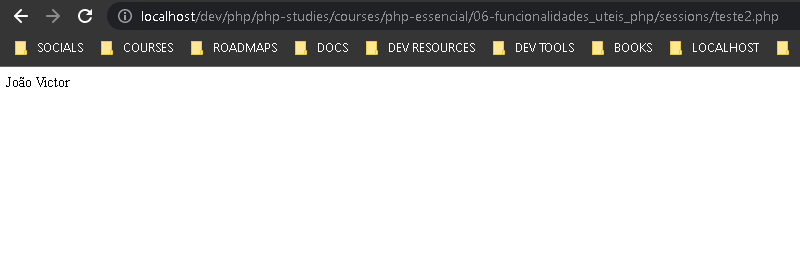

# Session

Diferente das superglobais $_POST e $_GET, a $_SESSION não é iniciada automaticamente, por isso sempre que formos trabalhar com sessions é importante iniciar com session_start():
```php
<?php

if(!isset($_SESSION))
    session_start();
```

## Acesso á session
As sessions que criamos são acessíveis em todas ás páginas do site.

````php
<?php
// TESTE.PHP
if(!isset($_SESSION))
    session_start();


$_SESSION['nomeDoUsuario'] = "João Victor";
````

````php
<?php
// TESTE2.PHP
if(!isset($_SESSION))
    session_start();


echo $_SESSION['nomeDoUsuario']
````

## Retorno de 'teste2.php' que exibe informações de uma sessions instanciada em outro arquivo:



- É importante iniciar a sessão para que a variável seja carregada

## Como geralmente funciona

Geralmente em aplicações criamos uma $_SESSION['id'] pada identificar usuário logado e assim definir que informações exibir

Também é possível verificar o nivel do usuário

### Session destroy

também é possível destruir uma sessão com o comando session_destroy()

```php
<?php
if(!isset($_SESSION))
    session_start();

session_destroy();

echo $_SESSION['nomeDoUsuario']
// NÃO RETORNA NADA POIS A SESSION NÃO EXISTE MAIS
```
- session destroy pode ser útil para o logout
