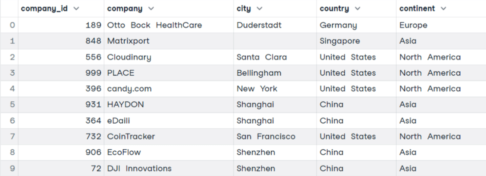
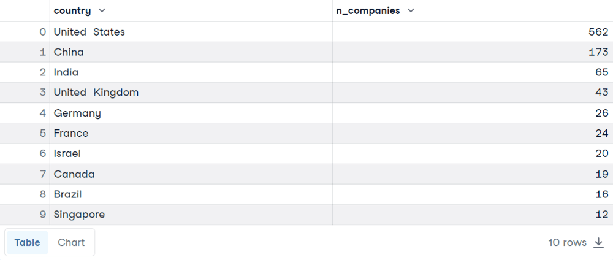

# Chapter 5: SELECT statement

## GROUP BY
O GROUP BY é geralmente usado para agregar dados e conseguir insights. Existem 3 fases ao utilizar o GROUP BY:

- Split: os dados são divididos em pedaços de linhas baseado nos valores das variaveis que escolhemos para agregar.

- Apply: Computa uma função de agregar, como media, minimo e máximo, retornando um único valor.

- Combine: Todos os resultados são combinados em uma unica tablela. Desse jeito, teremos um único valor para cada modalidade de variavel do nosso interesse.

<br>

## Exemplo de agrupamento
<br>

```sql
    SELECT * FROM companies
```


<br>
<hr>
<br>

```sql
    SELECT country, COUNT(*) AS n_companies
    FROM companies
    GROUP BY country
    ORDER BY n_companies DESC
    LIMIT 10
```


<br>
<hr>
<br>

## Exemplo de query no banco do SEI
```sql
    SELECT 
        EMP_MUNIBGE, 
        COUNT(*) AS mun_quant 
    FROM TB_EMPRESA 
    GROUP BY EMP_MUNIBGE 
    ORDER BY mun_quant DESC
```

<br>
<hr>
<br>

## Exemplo genérico
```sql
SELECT type, count(*) as c
FROM sys.objects
GROUP BY type

```
type - c <br>
SQ - 3 <br>
S - 72 <br>
IT - 16 <br>
PK - 1 <br>
U - 5 <br>

<br>
<hr>
<br>

## Agrupamento utilizando a clausula HAVING

```sql
SELECT type, count(*) as c
FROM sys.objects
GROUP BY type
HAVING count(*) < 10
```

type - c <br>
SQ - 3 <br>
PK - 1 <br>
U - 5 <br>

<br>
<hr>
<br>

## Retornando apenas x linhas
```sql
SELECT TOP 10 * FROM sys.object
```

<br>
<hr>
<br>

## Select sem from (no data source)
```sql
DECLARE @var INT = 17
SELECT @var AS c1, @var + 2 AS c2, 'third' AS c3
```